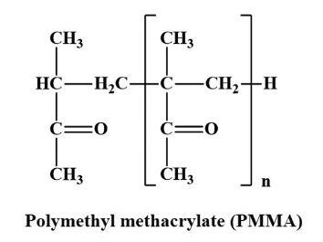

# Z1+ code

The Z1+ code creating the shortest multiple disconnected path for the analysis of entanglements in macromolecular systems is available for download [here at mendeley](https://data.mendeley.com/datasets/m425t6xtwr/1). The file at Mendeley does not contain the latest version of the Z1+import-lammps.pl script. Please download Z1+import-lammps.pl drom the scripts directory and overwrite Z1+import-lammps.pl you obtained from Mendeley with this latest version (before or after installing Z1+).  

The related publication describing all features is available for free [here at Comput. Phys. Commun.](https://www.sciencedirect.com/science/article/pii/S0010465522002867?via%3Dihub)

Here we collect questions, answers, and additional scripts that may be useful for Z1+ users. 

If you come across any problem during installing or testing Z1+, please be so kind to let me know, so that I can add the information for others to this site.  

## How to extract linear backbones from fully atomistic LAMMPS models 

Question: I am simulating atomistically detailed PMMA via LAMMPS, and have saved both a LAMMPS data file and a LAMMPS dump trajectory. Z1+ crashes as the LAMMPS files carry branched structures (chemical formula below). How to make it work? 

Answer: I created a script that automatically recognizes and extracts the linear backbones from your LAMMPS data file, and saves the linear conformation as Z1-formatted file config.Z1. The Z1+ code can then be directly applied to config.Z1. If you have both a LAMMPS data file and LAMMPS dump trajectory for the same system, this script creates a Z1-formatted trajectory file. The script is available for download in the scripts folder. Call it via

    perl ./extract-backbone.pl

or 

    perl ./extract-backbone.pl <lammps-data-file>

or

    perl ./extract-backbone.pl <lammps-data-file> <lammps-dump-trajectory>

Note. From 17 may 2024 onwards, the extract-backbone.pl script treats dump-trajectories with variable (cubic) box sizes. If you need a version that operates on triclinic boxes, let me know. 

## How to extract linear backbones from fully atomistic LAMMPS models, if the atomistic model contains non-polymers in addition?

Question posed by Jingqi Zhang in Feb 2024. I have LAMMPS data and dump-trajectories (id mol type xu yu zu) for a system that contains branched polymers as well as individual C60 beads (bead type 4). How to convert the dump-trajectory file to a Z1-trajectory file that contains only the linear backbones of the polymers? Such Z1-trajectory file can be analyzed directly using the Z1+ code, while the LAMMPS dump-trajectory file produces errors. 

Answer: The extract-backbone.pl script had been extended to contain a -ignore-types=<type1,type2,..> option. Call it via 

    perl ./extract-backbone.pl <lammps-data-file> <lammps-dump-trajectory> -ignore-types=4

If your system has more than a single atom type that need to be ignored, such as types 2,4, and 10, use -ignore-types=2,4,10.

## How to produce a Z1-formatted trajectory file from an unsorted LAMMPS dump-trajectory?

A LAMMPS dump-file does not contain information about bonds. Only if the dump-file had been generated using the dump_modify sort id option, and if your bead id is bonded to the adjacent bead id, Z1+ can recognize the chains. The LAMMPS data file, on the other hand, contains bond information. With a LAMMPS data and unsorted LAMMPS dump-trajectory at hand, you can use the extract-backbone.pl script to create a Z1-formatted trajectory file, as the extract-backbone.pl script retrieves information about the bonds from the data-file, and uses it to sort the trajectory file. 

    perl ./extract-backbone.pl <lammps-data-file> <unsorted-lammps-dump-trajectory>

## How to convert a Z1-formatted configuration or trajectory file to LAMMPS-dump-formatted file? 

    perl ./Z1+dump [-unfolded] <Z1-formatted-file>  

creates a LAMMPS-dump file or LAMMPS-dump trajectory file. If the option -unfolded is given, the dump-file contains unfolded coordinates (xu yu zu), otherwise it contains folded (wrapped) coordinates (x,y,z). The dump-file contains two bead types: type 1 (interior beads), type 2 (terminal beads). The script is available for download in the scripts folder. 
Note that a Z1-formatted file has all chain lengths in its third line. Z1+ also creates dat files (Z1+SP.dat, Z1+PPA.dat, Z1+initconfiguration.dat). Such .dat-files can be converted to a LAMMPS-dump trajectory myfile.dump using

    perl ./Z1+dat2dump [-unfolded] Z1+SP.dat > myfile.dump 

## How to merge shortest path and original configuration file into a single data or dump trajectory?

Call

    perl ./Z1+export.pl

to see the options. It creates data or dump files or trajectories for selected (or all) snapshots and assigns bead types 1,2,3 for the original chains, and bead types 4,5,6 for the shortest path. 

There is another script, that can be called after Z1+ finished. The following script creates lammps data files for the initial and/or shortest path configuration, to see the documentation, just type 

    perl ./Z1+SP-to-data.pl

## How to visualize or inspect a single chain with all chains entangled with it? 

This may done most conveniently using our script 

    perl ./extract-single-chain-entanglements.pl <ChainId> [-folded] [-txt] [-SP] [-ee] [-o=..]

Upon entering a chain ID, the script generates a lammps-formatted data file
(format: id mol type x y z, no charges) that contains the selected chain along with all
chains entangled with it. Note that the generated data file contains unfolded coordinates
by default. In this new data file, all atoms and bonds of the original chains have type 1.
By default, the name of the created data file is entangled-with-chain-ChainId.data
If the script is called without arguments, it returns the following description.

    ChainID
        A number between 1 and number of chains present in your system.
    -folded
        If you prefer to create a data file with folded coordinates, add the -folded option.
    -txt
        If you prefer to have the coordinates saved in txt-format, add the -txt option.
    -dat
        In addition to creating a lammps data file, create two files using the .dat-format.
        Z1+initconfig-chain=ChainID.dat contains the coordinates of the original chains,
        Z1+SP-chain=ChainID.dat contains the coordinates of the corresponding shortest paths. The dat format is: 
            Number of chains
            boxx boxx boxy
            number of nodes of chain #1
            x y z
            ...
            number of nodes of chain #2
            x y z
            ...
            etc
    -SP
        Add the shortest paths of all chains (atom and bond type 2) to the created data file.
    -ee
        Add the end-to-end bonds (bond type 3) to the created data file.
    -o=<filename>
        Write the data file to <filename> instead of using the default.

## How to add nanoparticles and rigid bodies to my configuration prior applying Z1+?

There is repository [Zmesh](https://github.com/popolin522/Zmesh) available that provides reasons on why and how rigid bodies can be meshed and used directly with 
a polymer configuration in Z1+. In short, you can add any kind of surface mesh made of dumbbells (polymers with 2 beads only) to your configuration file (lammps data
file, in particular). Since Z1+ does not move the terminal atoms of chains, the surface(s) will serve as obstacles.

## How to analyze a sheared, atomistic dump trajectory?

You need a lammps data file of the unsheared system, as well as a dump trajectory file. Z1+ assumes that you shear in x-direction, gradient in y-direction, so that the only nonzero tilt is xy. Extract the backbone and tilt values, pass them over to config.Z1, and start Z1+ via

        perl ./extract_backbone.pl <myfile.data> <myfile.dump>;
        perl ./Z1+

## Are there benchmark configurations to test my own implementation of Z1+?

Yes, some of the benchmark configurations treated in the publication are available from the benchmark-configurations directory. 

## The -PPA (and -PPA+) option produces no useful result

This happens if the system is not of standard Kremer-Grest type, with a maximum bond length of 1.5. The PPA option has been added using classical PPA parameters, and can therefore only be applied if the system respects the constraint. We did not invent new PPA parameters to allow for a comparison with classical PPA results, and because results depend on the choice of parameters. If your system has a bond length that exceeds the maximum allowed value 1.5 is seen in this line:

        PPA+ init max bondl (all)     1.54848

If you still want to use the PPA or PPA+ options, you have to scale your box sizes and particle coordinates in your configuration file.

## Z1+ crashes because the the lammps data and/or dump files created by vmd or other software seem to be corrupt.

Z1+ crashes, because the data and/or dump files may not contain the molecule IDs. To heal this problem we offer a script that corrects data and dump files using just one command, and saves the new files with "-corrected" appended to their original names. Call

        perl convert_vmd_data_to_proper_data.pl

to see the description. A typical call is 

        perl convert_vmd_data_to_proper_data.pl -data=MyLammps.data -dump=MyLammps.dump 

## Z1+ results exhibit periodic oscillations when analysing a sheared dump trajectory

This problem was caused by a sign problem in the conversion from xlobound to xlo, and had been fixed. Download Z1+import-lammps.pl from the scripts directory and overwrite your existing Z1+import-lammps.pl located within in your Z1+ installation directory. There is no need to re-install Z1+. 

## Error message: cp: target 'config.Z1' is not a directory

The original CPC version of Z1+ was developed on a platform where blanks in directory and file names are prohibited. Therefore please install Z1+ in a directory whose parents have no blanks in directory names, or alternatively, replace the file Z1+template.pl residing in your installation directory by Z1+template.pl offered in the replacements folder (and let me know if this solved your problem). 

## Error message: severe (64): input conversion error

This error appears if the time step in your lammps dump file exceeds 2147483647, the largest default-sized integer. 

## Error message: Z1+ crashed if Z1+ is applied to a sheared lammps data file 

Please download the updated Z1+import-lammps.pl file from the scripts directory and replace your existing file by the new one. There is no need to reinstall Z1+. The error was due to a missing line (marked by 13 nov 2024). 

## How to cite the Z1+ code?

    M. Kröger, J. D. Dietz, R. S. Hoy and C. Luap,
    The Z1+package: Shortest multiple disconnected path for the analysis of entanglements in macromolecular systems,
    Comput. Phys. Commun. 283 (2023) 108567. DOI 10.1016/j.cpc.2022.108567

or if you are using bibtex:

    @article{Z1+,
     author = {M. Kr\"oger and J. D. Dietz and R. S. Hoy and C. Luap},
     title = {The Z1+package: Shortest multiple disconnected path for the analysis of entanglements in macromolecular systems},
     journal = {Comput. Phys. Commun.},
     volume = {283},
     pages = {108567},
     year = {2023},
     doi = {10.1016/j.cpc.2022.108567}
    }
